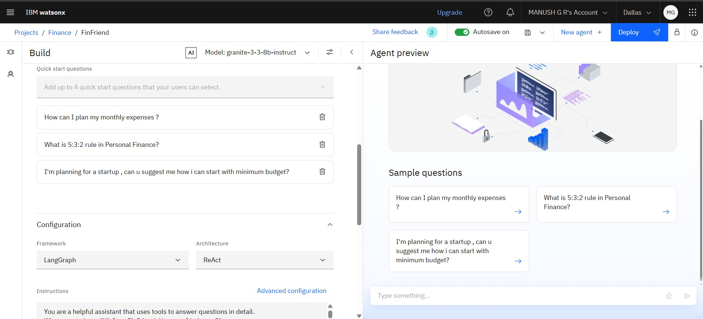

# Financial Literacy AI Agent ֎🇦🇮

Project Title: FinFriend – Your Smart Guide to Digital Finance

Introduction:
FinFriend is an AI-powered virtual assistant designed to help users safely navigate and understand the world of digital finance. Built using IBM Watsonx.ai and Retrieval-Augmented Generation (RAG), FinFriend offers accurate, real-time, and trustworthy guidance on a wide range of financial topics such as UPI, interest rates, stock market trends, personal finance, investments, loan safety, fraud detection, and online scam awareness.

With its multilingual support, FinFriend ensures that financial knowledge is accessible to users from all regions and backgrounds. Whether you're new to digital banking or looking to make smarter investment decisions, FinFriend acts as your personal finance companion, available 24/7 to provide clear, safe, and reliable assistance.

---

---

## Problem Statement ⚠️

In many rural and digitally underserved areas, people often lack the financial literacy needed to navigate the digital world. They face difficulties understanding systems like UPI, interest rates, personal budgeting, and are especially vulnerable to online scams and fraud. This lack of awareness leads to financial mistakes, digital exclusion, and loss of trust in digital services.

---

## Proposed Solution ✅

FinFriend is a smart AI assistant that acts like your personal guide for digital finance. It gives clear, safe, and accurate advice on everything from using UPI and managing money to avoiding scams and making smart investments. Built using IBM Watsonx.ai and RAG, FinFriend can talk in different languages, answer your questions 24/7, and help you make better financial choices without any confusion.

---

## Technologies Used 🧑‍💻

**1. IBM Granite Foundation Model (LLM)**
Powers the core intelligence of FinFriend by enabling deep understanding and generation of human-like financial responses.

**2. Retrieval-Augmented Generation (RAG) with Vector Indexing**
Enhances answer accuracy by retrieving relevant data from trusted documents before generating a response.

**3. Natural Language Processing (NLP)**
Allows FinFriend to understand user queries in simple language and respond conversationally across different financial topics.

**4. IBM Watsonx.ai Studio**
Provides the environment to develop, fine-tune, and deploy trustworthy AI models effectively.

**5. IBM Cloud Object Storage**
Used to securely store documents, datasets, and reference material for AI training and retrieval.

---

## IBM Cloud Services Used 🌐

**1. IBM Cloud Lite Account**
Provides free access to core IBM Cloud services used to build and deploy the FinFriend assistant.

**2. Watsonx.ai Studio**
A powerful platform for building, training, and managing AI models with trust and transparency.

**3. IBM Cloud IAM (Identity and Access Management)**
Ensures secure authentication, authorization, and role-based access control for all cloud resources.

**Watsonx Vector Index**
Enables Retrieval-Augmented Generation (RAG) by efficiently searching vectorized documents for accurate, context-aware responses.

**4. IBM Granite Model**
A foundation LLM that drives FinFriend's ability to understand complex financial questions and generate clear responses.

**5. IBM Cloud Object Storage**
Used to securely store and retrieve PDFs, datasets, and other knowledge sources like RBI and NPCI documents.

---

## WOW Factors ✨

**1. Built on IBM Watsonx with RAG for Verified Knowledge**
FinFriend fetches real answers from trusted sources like RBI and NPCI PDFs, ensuring factual accuracy.

**2. Multilingual & Inclusive by Design**
Supports multiple Indian languages to help users from diverse backgrounds understand digital finance easily.

**3. Polite, Safe & Scam-Aware Conversations**
Detects off-topic or unsafe queries and gently redirects users while promoting online safety.

**4. Covers Full Spectrum of Financial Literacy**
Empowers users with knowledge on UPI, budgeting, loans, interest rates, investments, and fraud prevention.

**5. End-to-End Deployment on IBM Cloud**
Completely hosted and powered by IBM Cloud services — secure, scalable, and future-ready.

---

## Target End Users 👥

**1. Rural Citizens and First-Time Digital Users**
Individuals with limited access to financial education who need simple, trusted guidance on digital finance tools like UPI and online banking.

**2. Students and Young Adults**
New earners or college students looking to understand personal budgeting, investments, and safe online financial practices.

**3. Senior Citizens**
Older adults who may be unfamiliar with digital finance and are more vulnerable to online fraud or scams.

**4. Small Business Owners and Local Vendors**
Entrepreneurs who want to manage digital transactions, understand interest rates, or seek guidance on loans and savings.

**5. Low-Income Households**
Families needing help with managing income, avoiding loan traps, and making informed financial decisions.

**6. Regional Language Speakers**
Individuals who prefer financial guidance in their native language — enabled by FinFriend’s multilingual support.

**7. General Public**
Anyone looking for a 24/7, easy-to-use, AI-powered assistant to clarify doubts on digital finance and stay safe online.

---

## Key Features 🗝️

**1. Conversational AI Assistant**
Interacts naturally with users, answering questions in a friendly and easy-to-understand manner.

**2. RAG-Powered Smart Retrieval**
Fetches accurate responses directly from RBI, NPCI, or uploaded PDFs using Retrieval-Augmented Generation.

**3. Multilingual Support**
Communicates in multiple Indian languages to ensure inclusivity for users across regions.

**4. Scam & Fraud Awareness Guidance**
Educates users on how to identify and avoid online scams, phishing, and unsafe financial practices.

 **5. Personal Finance Education**
Helps users understand budgeting, saving, interest rates, digital payments, and basic investing.

---

## How It Works ⚙️

**1. User asks a question in their preferred language**
(e.g., “How do I check if a loan app is fake?”) via a chat interface.

**2. Multilingual NLP engine processes the input**
Understands intent, language, and financial context using IBM Watsonx tools.

**3. Granite LLM + Vector Index work together**
The system searches uploaded PDFs (like RBI/NPCI guidelines) to fetch reliable, context-specific data.

**4. FinFriend formulates a personalized response**
Combines retrieved facts with natural-language generation to deliver user-friendly advice.

**5. Safety layer detects off-topic or scam-related queries**
FinFriend politely redirects or warns users when unsafe or unrelated content is detected.

---
## Results Refference.
### 🔹 Setting up

### 🔹 Agent Instructions

### 🔹 Quick Start Questions

### 🔹 Tools used & Testing

### 🔹 Deployment & Preview

### 🔹 API References after Deployment

### 🔹 Resources List

---

## How to Run or Deploy 💻

1. Log in to IBM Cloud Lite: https://cloud.ibm.com
2. Launch Watsonx.ai Studio
3. Create a new AI Agent
4. Upload financial PDFs to a Vector Index
5. Choose Tools for web search (Google,Wikipedia,DuckDuckGo etc..)
6. Configure agent instructions and topics (restricting AI from answering off-topic questions politely)
7. Test in the preview panel
8. Deploy via web snippet, Streamlit, or custom web UI

---

## Future Scope 🎯

**1. Voice-Based Interaction**
Integrate speech recognition to allow users to ask finance questions through voice in their native language.

**2. Mobile App Integration**
Launch FinFriend as a lightweight Android/iOS app for rural accessibility and offline-first capabilities.

**3. User Behavior Personalization**
Analyze user preferences over time to provide smarter, more customized financial guidance.

**4. Integration with Real Financial APIs**
Connect with banking or UPI APIs to provide live updates like transaction tracking, credit scores, or loan eligibility.

**5. Community & School-Level Finance Education Modules**
Expand FinFriend into an educational tool used in schools, NGOs, and rural training programs to promote financial literacy.

---
**Conclusion 👉**

FinFriend is more than just a chatbot — it's a trusted digital companion designed to bridge the financial literacy gap for users, especially those from rural and underserved areas. By leveraging IBM Watsonx.ai, Granite LLM, and Retrieval-Augmented Generation, FinFriend delivers accurate, accessible, and safe financial guidance in simple language.

With its user-friendly interface, multilingual capabilities, and focus on real-world financial topics like UPI, budgeting, loans, and fraud prevention, FinFriend empowers individuals to make smarter and safer financial decisions.

As digital finance continues to grow, FinFriend stands as a scalable, future-ready solution to promote financial inclusion and awareness for all.

---

## Some Useful Links 👇

- [IBM Cloud Lite](https://cloud.ibm.com/registration)
- [IBM Watsonx.ai](https://www.ibm.com/products/watsonx-ai)
- [RBI Official Website](https://www.rbi.org.in)
- [NPCI FAQs](https://www.npci.org.in/what-we-do/upi/faqs)
- [IBM SkillsBuild](https://skillsbuild.org)

---

## License ©

This project is licensed under the [MIT License](LICENSE).

---

> Created by **Manush G R** during the IBM SkillsBuild for Academia Internship 2025 provided by **Edunet Foundation** and **AICTE (All India Council for Technical Education)**
Department of Computational Science.

---

🤝🏻 [Connect with me on LinkedIn](https://www.linkedin.com/in/manush-g-r-8bbb23363)

